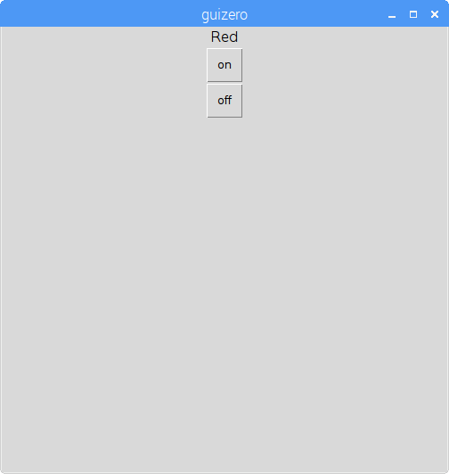
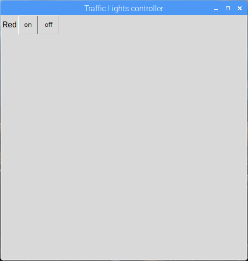

## Създайте GUI

1. Отворете нов прозорец и го запишете. Сега ще пишете код в този файл, а не директно в черупката.

2. Създайте бутон GUI, за да включите червения светодиод:
    
    ```python
от ипотека за импортиране на приложения, текстови, PushButton от импортиране на gpiozero TrafficLights светлини = TrafficLights (22, 27, 17) app = App () PushButton (app,
```


3. Добавете текстов етикет и втори бутон, за да изключите червения светодиод:
    
    ```python
Текст (app, "червен") PushButton (приложение, команда = lights.red.on, текст = "on") PushButton (приложение, команда = светлини.изкл.
```



4. Сега дайте на приложението си име и използвайте оформлението на решетката:
    
    ```python
app = App ("Traffic Lights controller", оформление = "решетка") Текст (app, "червен", grid = [0, 0] [0, 1]) PushButton (приложение, команда = червено, текст = "изключено", решетка = [0, 2])
```

