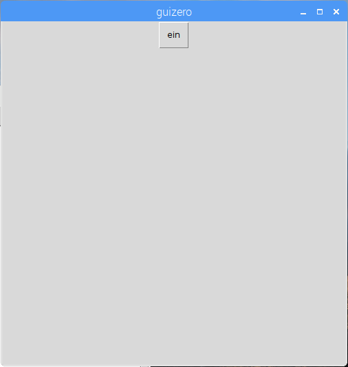

## Erstelle ein GUI

--- task ---

Schließe die REPL. Nun schreibst du deinen Code in eine Datei statt direkt in die Shell.

--- /task ---

--- task ---

Erstelle eine GUI-Schaltfläche, um die rote LED einzuschalten:

```python
from guizero import App, Text, PushButton
from gpiozero import TrafficLights

lampen = TrafficLights(22, 27, 17)

app = App()

PushButton(app, command=lampen.red.on, text="ein")

app.display()
```



--- /task ---

--- task ---

Füge eine Textbeschriftung und eine zweite Schaltfläche hinzu, um die rote LED auszuschalten:

```python
Text(app, "Rot")
PushButton(app, command=lampen.red.on, text="ein")
PushButton(app, command=lampen.red.off, text="aus")
```


--- /task ---

--- task ---

Gib deiner App jetzt einen Namen und verwende das Rasterlayout:

```python
app = App ("Ampelsteuerung", layout = "grid")

Text(app, "Rot", grid = [0, 0])
PushButton (app, Befehl = Lichter.red.on, text = "An", grid = [1, 0])
PushButton (app, command = Lichter.red.off, text ="Aus", grid = [2, 0])
```


--- /task ---