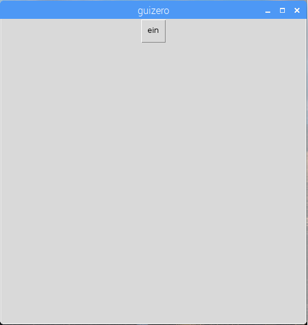
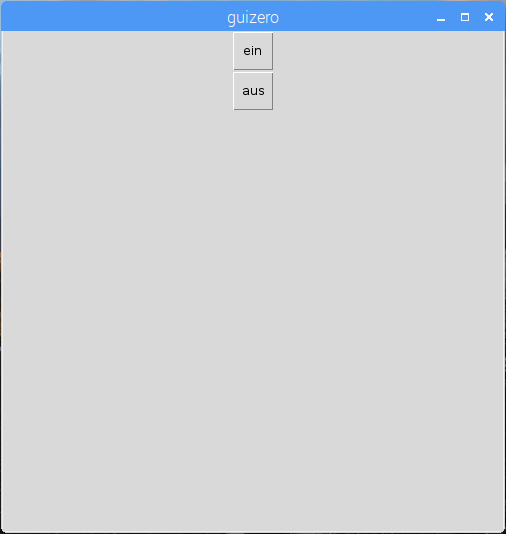
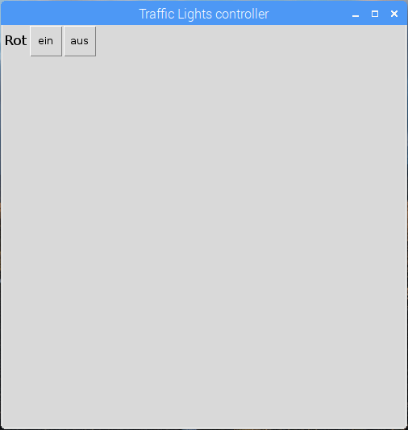

## Erstellen Sie ein GUI

1. Öffne ein neues Fenster und speichere es. Jetzt schreibst du Code in diese Datei anstatt direkt in die Shell.

2. Erstelle eine GUI-Schaltfläche, um die rote LED einzuschalten:
    
    ```python
from guizero import App, Text, PushButton
from gpiozero import TrafficLights

lampen = TrafficLights(22, 27, 17)

app = App()

PushButton(app, command=lampen.red.on, text="ein")

app.display()
```



3. Füge eine Textbeschriftung und eine zweite Schaltfläche hinzu, um die rote LED auszuschalten:
    
    ```python
Text(app, "Rot")
PushButton(app, command=lampen.red.on, text="ein")
PushButton(app, command=lampen.red.off, text="aus")
```



4. Gib deiner App einen Namen und verwende das Rasterlayout:
    
    ```python
app = App("Ampel-Steuerung", layout="grid")

Text(app, "Rot", grid=[0, 0])
PushButton(app, command=lampen.red.on, text="ein", grid=[0, 1])
PushButton(app, command=lampen.red.off, text="aus", grid=[0, 2])
```

