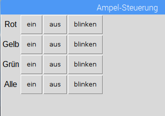

## Challenges

\--- task \---

Try adding on/off buttons for all 3 LEDs, making sure they're aligned properly in the grid

\--- /task \---

\--- task \---

Try adding a blink button for each LED

\--- /task \---

\--- task \---

Try adding buttons for all on / all off

\--- /task \---

\--- task \---

Try writing your own function to do the traffic lights sequence

- Use `def sequence()` and set the command to `sequence`
- Make sure to include `from time import sleep`

\--- /task \---