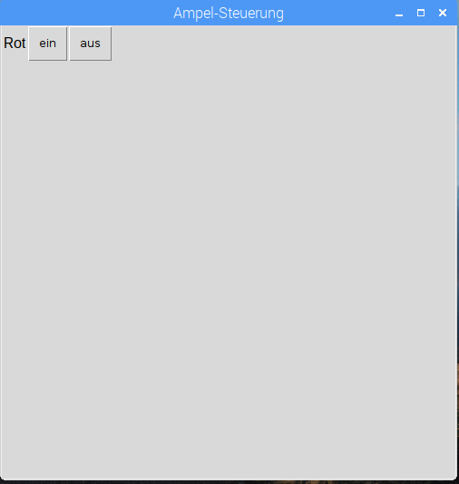

## Erstellen Sie eine GUI

1. Öffne ein neues Fenster und speichere es. Jetzt schreiben Sie Code in diese Datei anstatt direkt in die Shell.

2. Erstellen Sie eine GUI-Schaltfläche, um die rote LED einzuschalten:
    
    ```python
von guizero Import, Text, PushButton von gpiozero TrafficLights importieren lights = TrafficLights (22, 27, 17) app = App () PushButton (app, Befehl = lights.red.on, text = "on") app.display ()
```


3. Fügen Sie eine Textbeschriftung und eine zweite Schaltfläche hinzu, um die rote LED auszuschalten:
    
    ```python
Text (app, "Rot") PushButton (App, Befehl = lights.red.on, text = "on") PushButton (app, Befehl = lights.red.off, text = "aus")
```


4. Geben Sie Ihrer App einen Namen und verwenden Sie das Rasterlayout:
    
    ```python
app = App ("Ampelsteuergerät", layout = "grid") Text (app, "Rot", grid = [0, 0]) PushButton (app, befehl = red.on, text = "on", grid = [0, 1]) PushButton (app, Befehl = red.off, text = "aus", grid = [0, 2])
```

