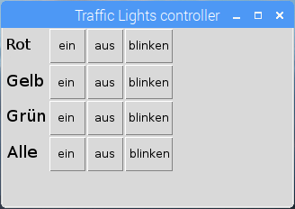

## Herausforderungen

1. Versuche die Ein- / Aus-Tasten für alle 3 LEDs zu verwenden und stelle sicher, dass sie im Raster korrekt ausgerichtet sind
    
    

2. Versuche für jede LED eine Blink-Taste hinzuzufügen

3. Versuche Schaltflächen für "alle Ein" / "Alle aus" hinzuzufügen

4. Versuche eine eigene Funktion zu schreiben, um einen Ampel-Ablauf zu machen
    
    - Verwende `def sequence()` und setze den Befehl auf `sequence`
    - Stelle sicher, dass `from time import sleep` enthalten ist