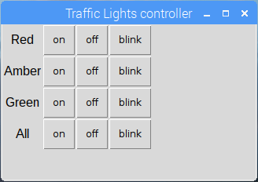

## Introduction

Create a traffic lights controller GUI (graphical user interface) using Python



--- collapse ---

---
title: What you will need
---

- Raspberry Pi computer
- LEDs:
    - pi-stop traffic light board
    - or 3x LEDs and resistors

You'll need to install Mu and guizero. Open a Terminal window and type the following command:

```bash
sudo apt install mu-editor
sudo pip3 install guizero
```

--- /collapse ---

--- collapse ---

---
title: What you will learn
---

- Controlling your Raspberry Pi's GPIO pins using Python
- Using LEDs with your Raspberry Pi
- Creating an interactive graphical user interface with Python

--- /collapse ---

--- collapse ---

---
title: Information for Jam organisers
---

--- no-print ---

We have two PDFs that cover the 3 projects in our [Python traffic lights path](https://projects.raspberrypi.org/en/pathways/python-traffic-lights){:target="_blank"}. One shows how to connect using LEDs and the other using a pi-stop. Each PDF covers different elements of our projects like adding a button, buzzer and GUI.

Our PDF versions are: 
+ [Interactive traffic lights with Python and LEDS](https://github.com/raspberrypilearning/jam-worksheets/raw/master/pdf/Traffic-Lights-Python.pdf). 
+ [Traffic lights with controller GUI using a pi-stop](https://github.com/raspberrypilearning/jam-worksheets/raw/master/pdf/Interactive-Traffic-Lights-Python.pdf).

Please observe any notes on this page before printing. 

--- /no-print ---

--- /collapse ---
