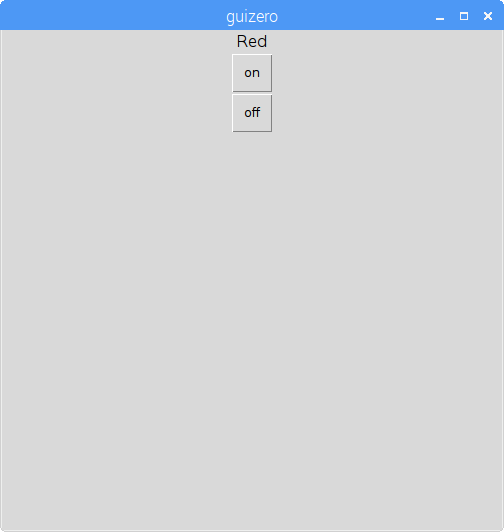

## Create a GUI

1. Open a new window and save it. Now you'll write code in this file rather than directly in the shell.

1. Create a GUI button to turn the red LED on:

    ```python
    from guizero import App, Text, PushButton
    from gpiozero import TrafficLights

    lights = TrafficLights(22, 27, 17)

    app = App()

    PushButton(app, command=lights.red.on, text="on")

    app.display()
    ```

    

1. Add a text label and a second button to turn the red LED off:

    ```python
    Text(app, "Red")
    PushButton(app, command=lights.red.on, text="on")
    PushButton(app, command=lights.red.off, text="off")
    ```

    

1. Now give your app a name, and use the grid layout:

    ```python
    app = App("Traffic Lights controller", layout="grid")

    Text(app, "Red", grid=[0, 0])
    PushButton(app, command=red.on, text="on", grid=[1, 0])
    PushButton(app, command=red.off, text="off", grid=[2, 0])
    ```

    
