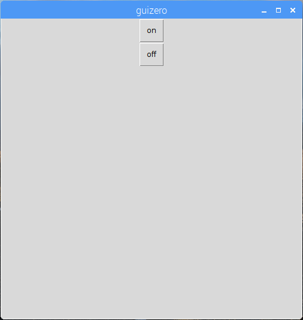
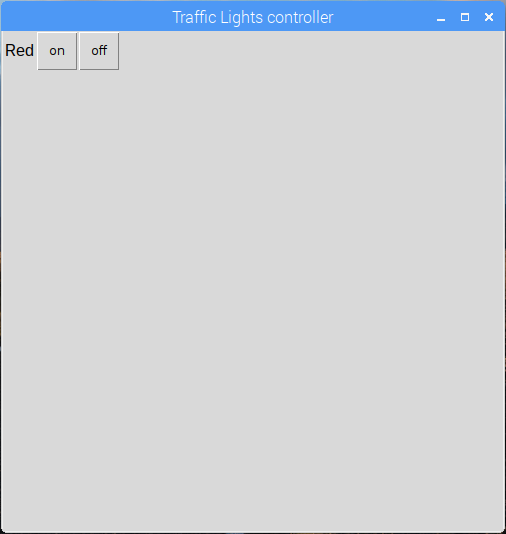

## ایجاد یک رابط کاربری گرافیکی

1. یک پنجره جدید را باز کنید و آن را ذخیره کنید. حالا کد را در این فایل بجای مستقیما در shell قرار دهید.

2. دکمه GUI را برای روشن کردن LED قرمز ایجاد کنید:
    
    ```python
از برنامه importion guizero، Text، PushButton از import gpiozero TrafficLights lights = TrafficLights (22، 27، 17) app = App () PushButton (app، command = lights.red.on، text = "on") app.display ()
```


3. یک برچسب متن و یک دکمه دوم برای خاموش کردن LED قرمز اضافه کنید:
    
    ```python
متن (برنامه، "قرمز") PushButton (app، command = lights.red.on، text = "on") PushButton (app، command = lights.red.off، text = "off")
```



4. اکنون برنامه خود را نامگذاری کنید و از طرح شبکه استفاده کنید:
    
    ```python
(برنامه، "قرمز"، شبکه = [0، 0]) PushButton (app، command = red.on، text = "on"، grid = [0، 1]) PushButton (app، command = red.off، text = "off"، grid = [0، 2])
```

