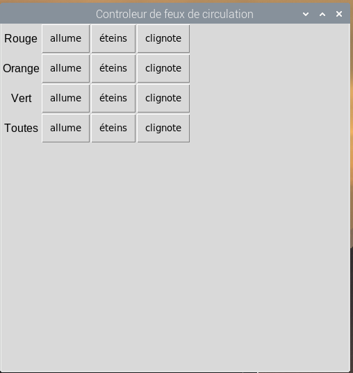

## Introduction

Créer une interface de contrôleur de feux de circulation GUI (interface utilisateur graphique) en utilisant Python



\--- collapse \---

* * *

## title: Ce qu'il te faut

- Un ordinateur Raspberry Pi
- LEDs : 
    - une carte pi-stop traffic light
    - ou 3 LEDs et des résistances

Tu devras installer Mu et guizero. Ouvre la fenêtre du Terminal et tape la commande suivante :

```bash
sudo apt install mu-editor
sudo pip3 install guizero
```

\--- /collapse \---

\--- collapse \---

* * *

## title: Ce que tu vas apprendre

- Contrôler les GPIO de ton Raspberry Pi en utilisant Python
- Utiliser des LEDs avec ton Raspberry Pi
- Créer une interface utilisateur graphique interactive avec Python

\--- /collapse \---

\--- collapse \---

* * *

## title: Informations pour les organisateurs de Jam

\--- no-print \---

Si vous avez besoin d'imprimer ce projet, une [version PDF](https://github.com/raspberrypilearning/jam-worksheets/raw/master/pdf/Traffic-Lights-GUI.pdf) est disponible. Veuillez considérer toutes les notes de cette page avant d'imprimer.

\--- /no-print \---

\--- /collapse \---