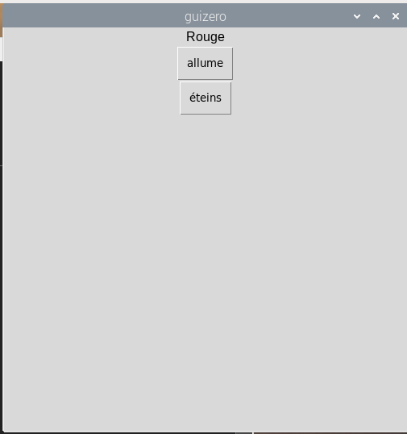

## Créer une interface graphique

\--- task \---

Ferme le REPL. Maintenant, tu vas écrire du code dans un fichier plutôt que directement dans le shell.

\--- /task \---

\--- task \---

Créer un bouton GUI pour allumer la LED rouge :

```python
from guizero import App, Text, PushButton
from gpiozero import TrafficLights

lampes = TrafficLights(22, 27, 17)

app = App()

PushButton(app, command=lampes.red.on, text="allume")

app.display()
```


\--- /task \---

\--- task \---

Ajoute une étiquette et un deuxième bouton pour éteindre la LED rouge :

```python
Text(app, "Rouge")
PushButton(app, command=lampes.red.on, text="allume")
PushButton(app, command=lampes.red.off, text="éteins")
```



\--- /task \---

\--- task \---

Donne maintenant un nom à ton application et utilise la mise en page grille :

```python
app = App("Contrôleur de feux de circulation", layout="grid")

Text(app, "Rouge", grid=[0, 0])
PushButton(app, command=lampes.red.on, text="allume", grid=[1, 0])
PushButton(app, command=lampes.red.off, text="éteins", grid=[2, 0])
```


\--- /task \---