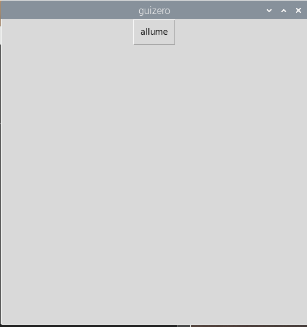
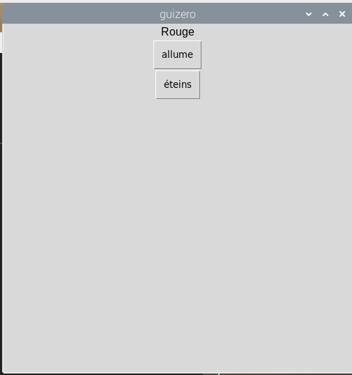
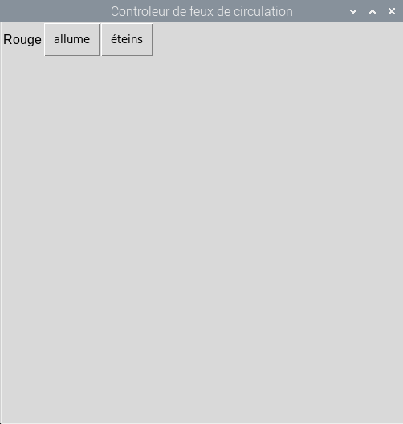

## Créer une interface graphique

1. Ouvrez une nouvelle fenêtre et enregistrez-la. Vous allez maintenant écrire du code dans ce fichier plutôt que directement dans le shell.

2. Créez un bouton GUI pour allumer la LED rouge:
    
    ```python
à partir de guizero import App, Texte, PushButton à partir de gpiozero import TrafficLights lumières = TrafficLights (22, 27, 17) app = App () PushButton (app, commande = lights.red.on, texte = "on") app.display ()
```



3. Ajoutez une étiquette de texte et un second bouton pour éteindre la LED rouge:
    
    ```python
Texte (app, "Rouge") PushButton (app, commande = lights.red.on, text = "on") PushButton (app, commande = lights.red.off, text = "off")
```



4. Donnez un nom à votre application et utilisez la disposition de la grille:
    
    ```python
app = App ("Traffic Lights controller", layout = "grille") Texte (app, "Rouge", grille = [0, 0]) PushButton (app, commande = red.on, text = "on", grille = [0, 1]) PushButton (app, commande = red.off, text = "off", grille = [0, 2])
```

