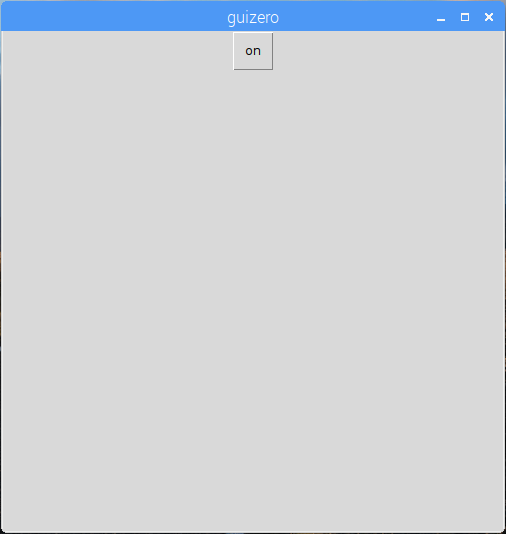

## एक GUI बनाएँ

1. एक नई विंडो खोलें और इसे सहेजें। अब आप सीधे इस शेल में कोड की बजाय इस फाइल में कोड लिखेंगे।

2. लाल एलईडी को चालू करने के लिए एक GUI बटन बनाएं:
    
    ```python
ट्रैफिक लाइट्स = ट्रैफ़िक लाइट्स (22, 27, 17) ऐप = ऐप () पुशबुटटन (ऐप, कमांड = लाइट्स.एड.ऑन, टेक्स्ट = "ऑन") एप डिस्प्ले () से गुइज़ोरो आयात ऐप, पाठ, पुशबूटन से आयात करें
```



3. लाल एलईडी बंद करने के लिए एक पाठ लेबल और दूसरा बटन जोड़ें:
    
    ```python
पाठ (एप, "रेड") पुशबुटन (ऐप, कमांड = लाइट्स.रेड.ऑन, टेक्स्ट = "ऑन") पुशबूटन (ऐप, कमांड = लाइट्स.एड.ऑफ़, टेक्स्ट = "ऑफ़")
```


4. अब अपने ऐप को एक नाम दें, और ग्रिड लेआउट का उपयोग करें:
    
    ```python
एप = ऐप ("ट्रैफिक लाइट्स कंट्रोलर", लेआउट = "ग्रिड") टेक्स्ट (ऐप, "रेड", ग्रिड = [0, 0]) पुशबुटन (ऐप, कमांड = रेड.ऑन, टेक्स्ट = "चालू", ग्रीड = [0, 1]) पुशबुटन (ऐप, कमांड = रेड.ऑफ़, टेक्स्ट = "ऑफ", ग्रिड = [0, 2])
```

