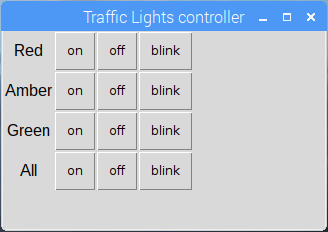

## चुनौतियाँ

\--- task \---

तीनों एल. ई. डी. को चालू/बंद करने के लिए बटन जोड़ने की कोशिश करें, यह सुनिश्चित करें कि वे ग्रिड में ठीक से संरेखित हो

\--- /task \---

\--- task \---

प्रत्येक एल. ई. डी. के लिए ब्लिंक बटन जोड़ने का प्रयास करें

\--- /task \---

\--- task \---

सभी चालू/सभी बंद करने के लिए बटन जोड़ने का प्रयास करें

\--- /task \---

\--- task \---

ट्रैफिक लाइट अनुक्रम के लिए अपना स्वयं का फ़ंक्शन लिखने का प्रयास करें

- `def sequence()` का उपयोग करें और आदेश को `sequence` सेट करें
- सुनिश्चित करें कि `from time import sleep` शामिल हो

\--- /task \---