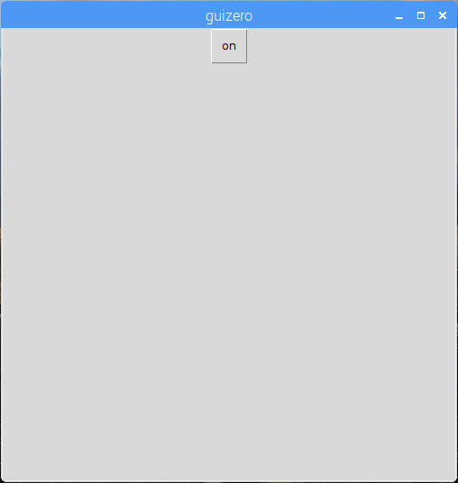

## Hozzon létre egy GUI-t

1. Nyisson meg egy új ablakot, és mentse el. Így írhatsz kódot ebben a fájlban, nem pedig közvetlenül a shellben.

2. Hozzon létre egy GUI gombot a piros LED bekapcsolásához:
    
    ```python
a guizero importtól App, Text, PushButton a gpiozero importból TrafficLights lights = TrafficLights app.display () app.display () app = App () PushButton (app, command = lights.red.on, text = "on"
```



3. A piros LED kikapcsolásához szöveges címkét és egy második gombot adjon hozzá:
    
    ```python
PushButton (app, command = lights.red.on, text = "on") PushButton (app, parancs = lights.red.off, text = "off")
```


4. Most adjon nevet az alkalmazásnak, és használja a rácselrendezést:
    
    ```python
PushButton (app, command = red.on, text = "on", grid = grid = grid = [0, 1]) PushButton (app, command = red.off, szöveg = "kikapcsolva", grid = [0, 2])
```

