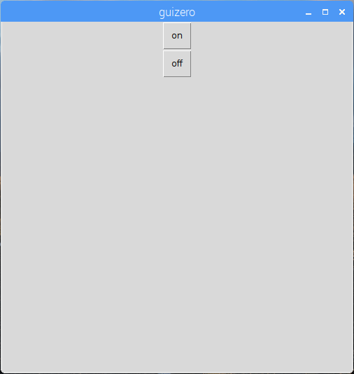
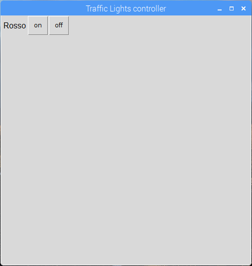

## Crea una GUI

1. Apri una nuova finestra e salvala. Ora scriverai il codice in questo file piuttosto che direttamente nella shell.

2. Crea un pulsante GUI per accendere il LED rosso:
    
    ```python
da guizero import App, Text, PushButton da gpiozero import TrafficLights lights = TrafficLights (22, 27, 17) app = App () PushButton (app, command = lights.red.on, text = "on") app.display ()
```


3. Aggiungi un'etichetta di testo e un secondo pulsante per spegnere il LED rosso:
    
    ```python
Testo (app, "Rosso") PushButton (app, command = lights.red.on, text = "on") PushButton (app, command = lights.red.off, text = "off")
```



4. Ora dai un nome alla tua app e utilizza il layout della griglia:
    
    ```python
app = App ("Controller semafori", layout = "griglia") Testo (app, "Rosso", griglia = [0, 0]) PushButton (app, command = red.on, text = "on", grid = [0, 1]) PushButton (app, command = red.off, text = "off", grid = [0, 2])
```

