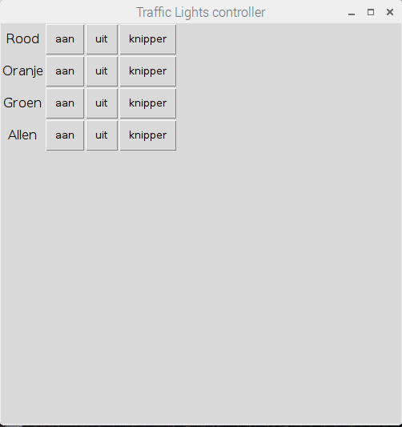

## Invoering

Creëer een GUI voor verkeerslichten (grafische gebruikersinterface) met GPIO Zero en guizero.

### Wat ga je maken?

U maakt een GUI om een ​​set van verkeerslicht-LED's te besturen:

