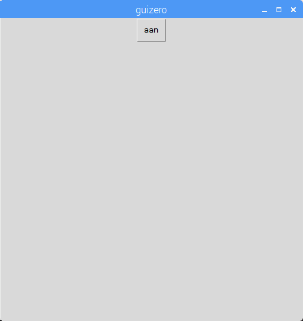
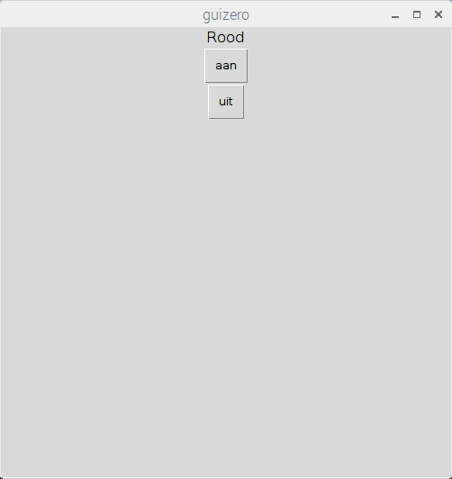
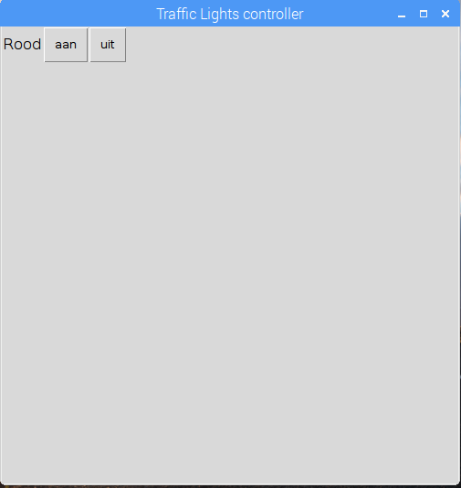

## Maak een GUI

\--- task \---

Close the REPL. Now you'll write code into a file rather than directly in the shell.

\---/task\---

\--- task \---

Maak een GUI-knop om de rode LED aan te zetten:

```python
from guizero import App, Text, PushButton
from gpiozero import TrafficLights

lights = TrafficLights(22, 27, 17)

app = App()

PushButton(app, command=lights.red.on, text="aan")

app.display()
```



\--- /task \---

\--- task \---

Voeg een tekstlabel en een tweede knop toe om de rode led uit te schakelen:

```python
Text(app, "Rood")
PushButton(app, command=lights.red.on, text="aan")
PushButton(app, command=lights.red.off, text="uit")
```



\--- /task \---

\--- task \---

Geef je app nu een naam en gebruik de raster indeling:

```python
app = App("Traffic Lights controller", layout="grid")

Text(app, "Red", grid=[0, 0])
PushButton(app, command=lights.red.on, text="on", grid=[1, 0])
PushButton(app, command=lights.red.off, text="off", grid=[2, 0])
```



\--- /task \---