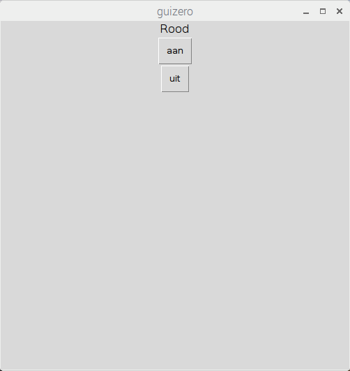

## Maak een GUI

1. Open een nieuw venster en sla het op. Nu zul je code in dit bestand schrijven in plaats van direct in de shell.

2. Maak een GUI-knop om de rode LED aan te zetten:
    
    ```python
from guizero import App, Text, PushButton from gpiozero importen TrafficLights lights = TrafficLights (22, 27, 17) app = App () PushButton (app, opdracht = lights.red.on, text = "on") app.display ()
```


3. Voeg een tekstlabel en een tweede knop toe om de rode led uit te schakelen:
    
    ```python
Tekst (app, "Rood") PushButton (app, opdracht = lights.red.on, text = "on") PushButton (app, opdracht = lights.red.off, text = "off")
```



4. Geef uw app nu een naam en gebruik de rasterlay-out:
    
    ```python
app = App ("Verkeerslichtcontroller", layout = "raster") Tekst (app, "Rood", raster = [0, 0]) PushButton (app, opdracht = red.on, text = "on", raster = [0, 1]) PushButton (app, opdracht = red.off, text = "off", grid = [0, 2])
```

